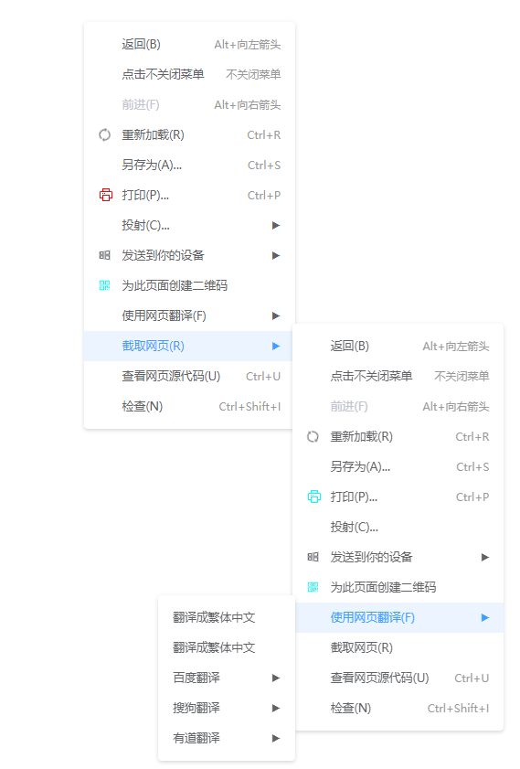

# vue3-menus

Vue3.0 自定义右键菜单，支持 Vite2.0

Vue3.0 原生实现完全自定义右键菜单组件, 零依赖，可根据可视区域自动调节显示位置，可支持插槽完全重写每一项菜单



## 在线演示

- [完整菜单功能演示](https://codepen.io/xfy520/pen/yLXNqzy)
- [复制粘贴演示](https://codepen.io/xfy520/pen/xxrGJdg)

## 快速安装

### npm 安装

```shell
npm install vue3-menus
```

或

```shell
yarn add vue3-menus
```

### CDN

```html
<script src="https://unpkg.com/vue3-menus/dist/vue3-menus.umd.min.js">
```

## 使用（Vite 情况下同样使用）

CDN引入则不需要 `app.use(Vue3Menus)`
> 样例中使用的是`@ant-design/icons-vue`图标与`@element-plus/icons`图标、图标可以使用`html`代码传入、也可以通过插槽`自定义图标`、也可以`完全重写每一项菜单`

```js
// 全局注册组件、指令、方法
import { createApp } from 'vue';
import Menus from 'vue3-menus';
import App from './App.vue';
const app = createApp(App);
app.use(Menus);
app.mount('#app');
// 单个注册某个，以下三种方式均可在单个文件内使用
import { createApp } from 'vue';
import { directive, menusEvent, Vue3Menus } from 'vue3-menus';
import App from './App.vue';
const app = createApp(App);
app.component('vue3-menus', Vue3Menus); // 只注册组件
app.directive('menus', directive); // 只注册指令
app.config.globalProperties.$menusEvent = menusEvent; // 只绑定方法
app.mount('#app');
```

```html
<template>
  <div style="height: 98vh; width: 100%;" v-menus:left="menus">
    <div class="div" v-menus:left="menus">指令方式打开菜单</div>
    <div class="div" @click.stop @contextmenu="($event) => $menusEvent($event, menus)">事件方式打开菜单</div>
    <div class="div" @click.stop @contextmenu="rightClick">组件方式打开菜单</div>
    <vue3-menus v-model:open="isOpen" :event="eventVal" :menus="menus.menus" hasIcon>
      <template #icon="{item: {activeIndex}}">{{activeIndex}}</template>
      <template #label="{ item: { item } }">插槽：{{ item.label }}</template>
    </vue3-menus>
  </div>
</template>
<script>
import { defineComponent, nextTick, ref, shallowRef } from "vue";
import { SyncOutlined, WindowsOutlined, QrcodeOutlined } from '@ant-design/icons-vue';
import { Printer } from '@element-plus/icons'

export default defineComponent({
  name: "App",
  setup() {
    const isOpen = ref(false);
    const eventVal = ref({});
    function rightClick(event) {
      isOpen.value = false;
      nextTick(() => {
        eventVal.value = event;
        isOpen.value = true;
      })
      event.preventDefault();
    }
    const menus = shallowRef({
      menus: [
        {
          label: "返回(B)",
          tip: 'Alt+向左箭头',
          click: () => {
            window.history.back(-1);
          }
        },
        {
          label: "点击不关闭菜单",
          tip: '不关闭菜单',
          click: () => {
            return false;
          }
        },
        {
          label: "前进(F)",
          tip: 'Alt+向右箭头',
          disabled: true
        },
        {
          label: "重新加载(R)",
          tip: 'Ctrl+R',
          icon: {
            node: SyncOutlined,
            option: {
              spin: true
            }
          },
          click: () => location.reload(),
          divided: true
        },
        {
          label: "另存为(A)...",
          tip: 'Ctrl+S'
        },
        {
          label: "打印(P)...",
          tip: 'Ctrl+P',
          icon: {
            node: Printer,
            option: {
              color: 'red'
            }
          },
          click: () => window.print(),
        },
        {
          label: "投射(C)...",
          divided: true
        },
        {
          label: '发送到你的设备',
          icon: WindowsOutlined,
          children: [
            {
              label: 'iPhone',
            },
            {
              label: 'iPad'
            },
            {
              label: 'Windows 11'
            }
          ]
        },
        {
          label: "为此页面创建二维码",
          divided: true,
          icon: {
            node: QrcodeOutlined,
            option: {
              style: {
                color: 'aqua'
              }
            }
          }
        },
        {
          label: "使用网页翻译(F)",
          divided: true,
          children: [
            { label: "翻译成繁体中文" },
            { label: "翻译成繁体中文" },
            {
              label: "百度翻译", children: [
                { label: "翻译成繁体中文" },
                { label: "翻译成繁体中文" },]
            },
            {
              label: "搜狗翻译", children: [
                { label: "翻译成繁体中文" },
                { label: "翻译成繁体中文" },
              ]
            },
            {
              label: "有道翻译", children: [
                { label: "翻译成繁体中文" },
                { label: "翻译成繁体中文" },
              ]
            },
          ]
        },
        {
          label: "截取网页(R)"
        },
        { label: "查看网页源代码(U)", tip: 'Ctrl+U' },
        { label: "检查(N)", tip: 'Ctrl+Shift+I' }
      ]
    })
    return { menus, isOpen, rightClick, eventVal }
  },
});
</script>
```

```css
.div {
  display: inline-block;
  background-color: aqua;
  margin: 0 20px;
  line-height: 200px;
  padding: 0 20px;
  height: 200px;
}
```

### 指令方式使用

```html
<template>
  <div v-menus:left="menus">指令方式打开菜单</div>
</template>
<script>
import { defineComponent, shallowRef } from "vue";
import { directive } from 'vue3-menus';

export default defineComponent({
  name: "App",
  directives: {
    menus: directive
  },
  setup() {
    const menus = shallowRef({
      menus: [
        {
          label: "返回(B)",
          tip: 'Alt+向左箭头',
          click: () => {
            window.history.back(-1);
          }
        },
        {
          label: "点击不关闭菜单",
          tip: '不关闭菜单',
          click: () => {
            return false;
          }
        }
      ]
    })
    return { menus }
  },
});
</script>
```

### 方法方式使用

```html
<template>
  <div class="div" @click.stop @contextmenu="rightClick">事件方式打开菜单</div>
</template>
<script>
import { defineComponent, shallowRef } from "vue";
import { menusEvent } from 'vue3-menus';

export default defineComponent({
  name: "App",
  setup() {
    const menus = shallowRef({
      menus: [
        {
          label: "返回(B)",
          tip: 'Alt+向左箭头',
          click: () => {
            window.history.back(-1);
          }
        },
        {
          label: "点击不关闭菜单",
          tip: '不关闭菜单',
          click: () => {
            return false;
          }
        }
      ]
    });
    function rightClick(event) {
      menusEvent(event, menus.value);
      event.preventDefault();
    }
    return { rightClick }
  },
});
</script>
```

### 组件方式使用

```html
<template>
  <div class="div" @click.stop @contextmenu="rightClick">组件方式打开菜单</div>
  <vue3-menus v-model:open="isOpen" :event="eventVal" :menus="menus" hasIcon>
    <template #icon="{item: {activeIndex}}">{{activeIndex}}</template>
    <template #label="{ item: { item } }">插槽：{{ item.label }}</template>
  </vue3-menus>
</template>
<script>
import { defineComponent, nextTick, ref, shallowRef } from "vue";
import { Vue3Menus } from 'vue3-menus';

export default defineComponent({
  name: "App",
  components: {
    Vue3Menus
  },
  setup() {
    const isOpen = ref(false);
    const eventVal = ref({});
    function rightClick(event) {
      isOpen.value = false;
      nextTick(() => {
        eventVal.value = event;
        isOpen.value = true;
      })
      event.preventDefault();
    }
    const menus = shallowRef([
      {
        label: "返回(B)",
        tip: 'Alt+向左箭头',
        click: () => {
          window.history.back(-1);
        }
      },
      {
        label: "点击不关闭菜单",
        tip: '不关闭菜单',
        click: () => {
          return false;
        }
      }
    ]);
    return { menus, isOpen, rightClick, eventVal }
  },
});
</script>
```

## 参数说明

### 单个菜单项参数`MenusItemOptions`

|   属性   |                                          描述                                          |         类型         | 是否必填 |   默认值    |
| :------: | :------------------------------------------------------------------------------------: | :------------------: | :------: | :---------: |
|  label   |                                       菜单项名称                                       |       `string`       |  `true`  |      —      |
|  style   |                                 每一项菜单的自定义样式                                 |       `object`       | `false`  |    `{}`     |
|   icon   | `string`: 传入图标html代码、`object`: 传入组件或者`{node: 组件, option: 组件配置参数}` | `string` \| `object` | `false`  | `undefined` |
| disabled |                                     是否禁用菜单项                                     |      `boolean`       | `false`  | `undefined` |
| divided  |                                     是否显示分割线                                     |      `boolean`       | `false`  | `undefined` |
|   tip    |                                  没项菜单后面的小提示                                  |       `string`       | `false`  |    `''`     |
|  click   |                     菜单项点击事件，返回`null`或`false`不关闭菜单                      |     `Function()`     | `false`  | `undefined` |
| children |                                     子菜单列表信息                                     | `MenusItemOptions[]` | `false`  | `undefined` |

### 公共参数`MenuOptions`

|      属性      |                   描述                   |           类型           |       是否必填       | 默认值 |
| :------------: | :--------------------------------------: | :----------------------: | :------------------: | :----: |
|     menus      |               菜单列表信息               |   `MenusItemOptions[]`   |        `true`        |   []   |
|   menusStyle   |              菜单容器的样式              |         `object`         |       `false`        |   {}   |
| menusItemClass |          菜单每一项的`class`名           |         `string`         |       `false`        | `null` |
|     event      |     鼠标事件信息(指令使用时可以不传)     |         `Event`          | 与`position`必填一项 |   {}   |
|    position    | 手动传入菜单显示位置(指令使用时可以不传) | `{x: number, y: number}` |  与`event`必填一项   |   {}   |
|    minWidth    |             菜单容器最小宽度             |  `number`  \| `string`   |       `false`        | `none` |
|    maxWidth    |             菜单容器最打宽度             |  `number`  \| `string`   |       `false`        | `none` |
|     zIndex     |                 菜单层级                 |  `number`  \| `string`   |       `false`        |  `3`   |

### 组件`Vue3Menus`参数

|      属性      |                   描述                   |           类型           |       是否必填       | 默认值  |                    插槽传入值                     |
| :------------: | :--------------------------------------: | :----------------------: | :------------------: | :-----: | :-----------------------------------------------: |
|     menus      |               菜单列表信息               |   `MenusItemOptions[]`   |        `true`        |   []    |
|   menusStyle   |              菜单容器的样式              |         `object`         |       `false`        |   {}    |
| menusItemClass |          菜单每一项的`class`名           |         `string`         |       `false`        | `null`  |
|     event      |     鼠标事件信息(指令使用时可以不传)     |         `Event`          | 与`position`必填一项 |   {}    |
|    position    | 手动传入菜单显示位置(指令使用时可以不传) | `{x: number, y: number}` |  与`event`必填一项   |   {}    |
|    minWidth    |             菜单容器最小宽度             |  `number`  \| `string`   |       `false`        | `none`  |
|    maxWidth    |             菜单容器最打宽度             |  `number`  \| `string`   |       `false`        | `none`  |
|     zIndex     |                 菜单层级                 |  `number`  \| `string`   |       `false`        |   `3`   |
|      open      |     控制菜单组件显示: `v-model:open`     |        `boolean`         |        `true`        | `false` |                      `false`                      |
|    default     |                 默认插槽                 |          `Slot`          |       `false`        |    -    | `activeIndex`: 当前选中项, `item`: 当前菜单属性值 |
|      icon      |                 图标插槽                 |          `Slot`          |       `false`        |    -    | `activeIndex`: 当前选中项, `item`: 当前菜单属性值 |
|     label      |               菜单标题插槽               |          `Slot`          |       `false`        |    -    | `activeIndex`: 当前选中项, `item`: 当前菜单属性值 |
|     suffix     |               菜单后缀插槽               |          `Slot`          |       `false`        |    -    | `activeIndex`: 当前选中项, `item`: 当前菜单属性值 |

### 指令使用配置

| 指令使用方式  |            描述            |   参数类型    | 参数是否必填 | 默认值 |
| :-----------: | :------------------------: | :-----------: | :----------: | :----: |
|    v-menus    |    绑定元素右击打开菜单    | `MenuOptions` |    `true`    |   -    |
|  v-menus:all  | 绑定元素左右击均可打开菜单 | `MenuOptions` |    `true`    |   -    |
| v-menus:left  |      绑定元素左击打开      | `MenuOptions` |    `true`    |   -    |
| v-menus:right |      绑定元素右击打开      | `MenuOptions` |    `true`    |   -    |
